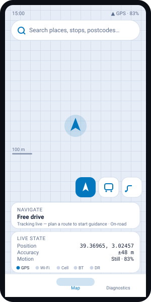
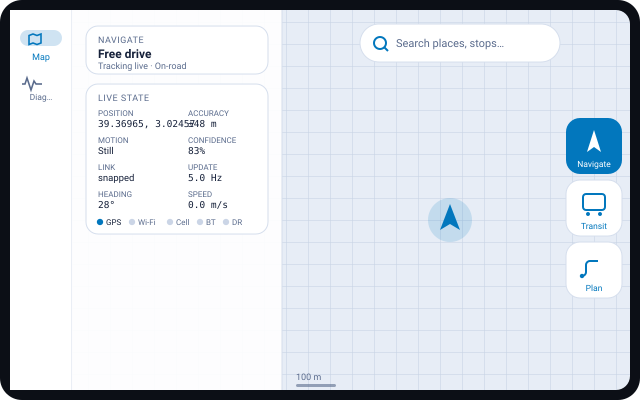

# Smart Maps A/E — Adaptive UI Preview

A layout preview rendered from the app's real `dimens` values and Compose
structure, so the adaptive architecture can be checked before installing the
APK. These are **layout diagrams, not screenshots of the running app** — the
real functional test is the release APK on a device (see
[`MOBILE_INSTALL.md`](MOBILE_INSTALL.md)).

Live State values below mirror the Tab S6 Lite photo (39.36965, 3.02457
±48 m · GPS · Still · 83%) — now in the tablet's two-column grid with the
sensor-fusion strip instead of the old collapsed one-line strip.

## Phone — Galaxy S25 (`values/`, 16 dp macro grid)

## Tablet — Galaxy Tab S6 Lite (`values-sw600dp/`, 24 dp macro grid)

## Conformance against the brief

| Requirement | Status | Where it lives |
|---|---|---|
| Map persistent & full-screen | ✅ | Owned by the root shell (`SmartMapsApp`), drawn first, `fillMaxSize`; modes only swap the cards above it |
| Map never a blank void | ✅ | `MapSurface` draws a live 100 m metric grid + scale bar + position halo even with no road graph |
| Tablet uses the tablet bucket | ✅ | `values-sw600dp/720dp` chosen from `smallestScreenWidthDp` — one source of truth, so no phone layout on tablet |
| Live State expands to two columns | ✅ | `sm_live_state_columns` 1 → 2; Diagnostics adds heading / speed / IMU / snap offset |
| Mode cluster doesn't stretch | ✅ | Fixed chip size (56 → 64 → 72 dp); horizontal on phone, vertical + labelled on tablet |
| Modes, not tabs | ✅ | Navigate / Transit / Plan toggle a floating cluster; tap again returns to free-map |
| Floating search preserved | ✅ | Edge-margined on phone; centred and width-capped over the map on tablet |
| Navigation adapts | ✅ | Bottom bar on phone, side rail on tablet (`sm_side_navigation`) |
| 8 / 16 / 24 dp grid | ✅ | 8 dp micro everywhere; 16 dp macro phone, 24 dp macro tablet, via qualified dimens |
| Sensor-fusion identity kept | ✅ | Coordinates, accuracy, motion, confidence, link, live Hz, per-source dots — prominent, never removed |

## On-device checklist (only your hardware can confirm)

Install the release APK on the Tab S6 Lite and verify:

1. Map fills the screen with the metric grid visible (no blank void).
2. You get the **side rail** (not a bottom bar) and a **fixed-width card pane** — the tablet layout, not the phone one.
3. Live State is a **two-column** card with the GPS / Wi-Fi / Cell / BT / DR dot strip.
4. The mode chips are **fixed-size squares**, not stretched full-width buttons.
5. Rotate to portrait — spacing recomputes, the map stays put.

## Source

- Layouts: [`app/src/main/java/com/smartmaps/ae/SmartMapsApp.kt`](android/app/src/main/java/com/smartmaps/ae/SmartMapsApp.kt) + `ui/components/`
- Buckets: `app/src/main/res/values{,-sw600dp,-sw720dp}/dimens.xml`
- Adaptive resolver: `ui/adaptive/Adaptive.kt`
